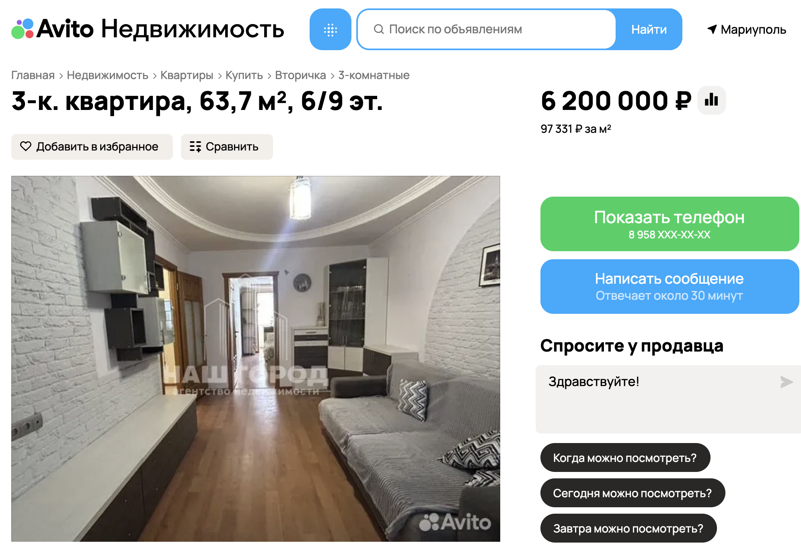
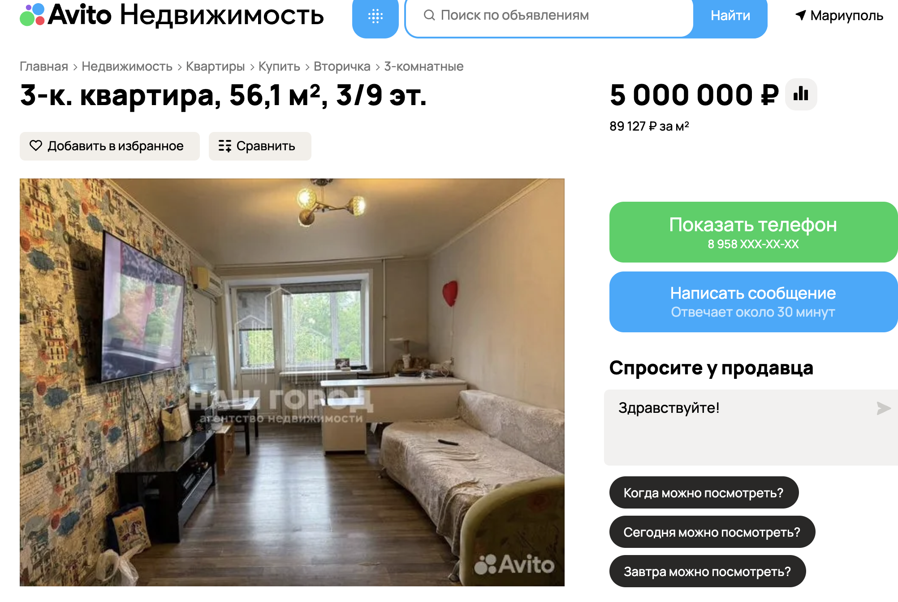
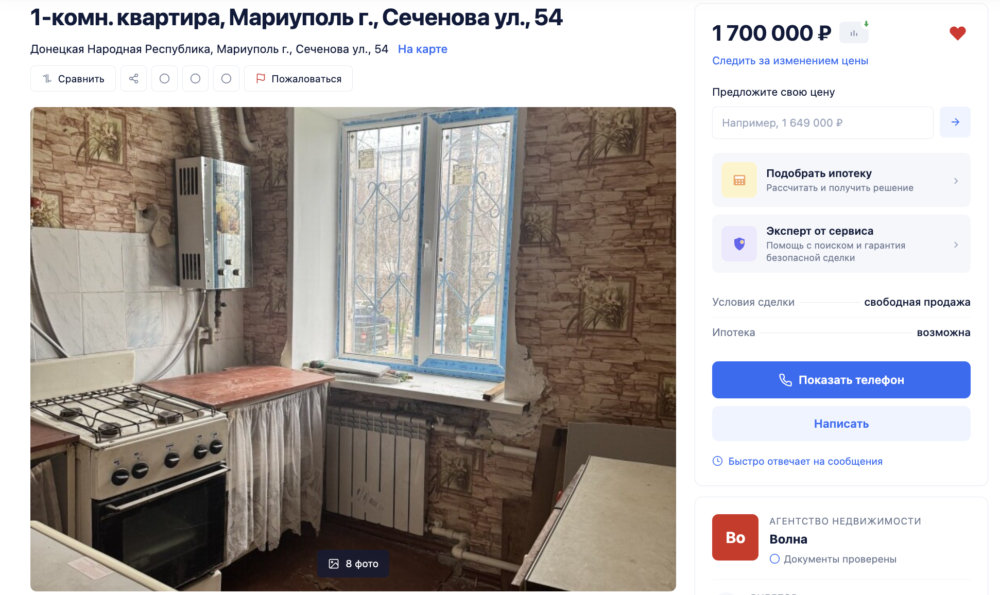
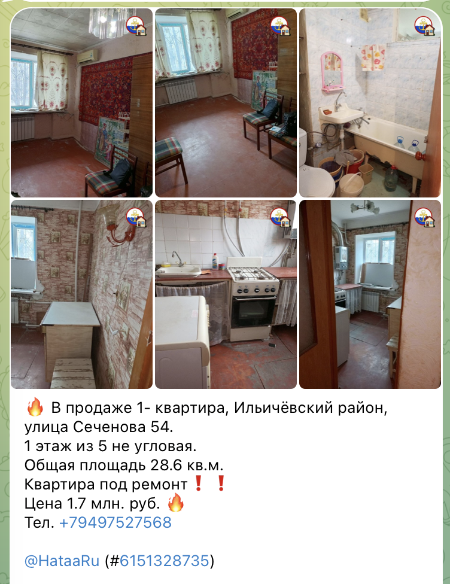

# Case Study — Mass "Ownerless" Registry Inclusion → Live Apartment Resale

**Three Mariupol apartment buildings where the occupation processed *dozens of
individual flats* through the «бесхозяйность» (ownerless) registry — and where
specific, identifiable units in those same buildings are, right now, being
actively and repeatedly advertised for sale on Russian Telegram classifieds.**

This is a distinct modality from the address-laundering case study
(`nakhimova_82_chernomorsky_1b.md`, which tracks one demolished/rebuilt
footprint). Here the building itself is untouched — what's been processed is
its *contents*, flat by flat, through the same administrative mechanism that
(per ФКЗ-4, 15.12.2025) now constitutes title transfer. The resale data —
produced by the new demand-side scan (`docs/demand_side_resale_scan.md`,
scripts 49–51) — supplies the first *direct, dated, market-level* evidence that
this registry inclusion is followed by disposal to third parties, ahead of the
1 July 2026 re-registration deadline.

---

## The three buildings

| Building | District | property.id | building_key | Registry apartments | RD4U |
|---|---|---|---|---|---|
| просп. Строителей, 108 | Жовтневый (Zhovtnevy) | 4589 | `AVENUE:строителей\|108` | **64** | A3.1, A3.6 |
| просп. Ленина, 100 (= просп. Миру, 100) | Жовтневый (Zhovtnevy) | 7242 | `AVENUE:ленина\|100` | **44** | A3.6 |
| ул. Сеченова, 54 | Ильичёвский (Ilyichevsky) | 5737 | `STREET:сеченова\|54` | **23** | A3.1, A3.6 |

**Registry source (Berkeley Protocol chain of custody):**
- Жовтневый р-н: `Zhovtnevyi_r_n.xlsx`, SHA-256 `add72b41…cfeae`, captured
  2026-06-09 16:27 — covers Строителей 108 and Ленина 100.
- Ильичёвский р-н: `Il_ichevskii_r_n.xlsx`, SHA-256 `140dfbf9…f9e60`, captured
  2026-06-09 16:27 — covers Сеченова 54.

Both are XLSX exports from `mariupol-r897.gosweb.gosuslugi.ru`, the occupation
municipal "ownerless registry" portal — the same 12,948-entry master list
described in `memory/federal_law_dec2025_pivot.md`. Each row carries
`recognition_marker: "признаки бесхозяйности"` (signs of ownerlessness) and an
`apt_raw` apartment number — i.e. these are not building-level entries but
**one line per flat**.

---

## просп. Строителей, 108 — 64 flats registered, 2 distinct units now for sale

**Registry:** apartments 3, 17, 19, 21, 25, 28, 31, 32, 34, 35, 37, 38, 40, 43,
46, 47, 48, 51, 52, 54, 55, 56, 60, 61, 63, 66, 71, 73, 75, 78, 79, 82, 85, 86,
88, 89, 91, 92, 101, 107, 108, 113, 117, 119, 120, 124, 125, 141, 145–160 —
**64 of this building's flats**, all flagged "признаки бесхозяйности" in the
same June-2026 export.

**Resale — unit A (59 m², 3-room, floor 3/9, "С МЕБЕЛЬЮ И ТЕХНИКОЙ"):**
- Posted 2026-05-12 (`t.me/mariupolskiy_uezd/246609`, sha `cb202c79…3eb7e`) and
  reposted 2026-05-22 (`/248089`, sha `e4bbb124…a36d99`). Price **5,200,000 ₽**.

**Resale — unit B (64 m² / 44 m² жилая / 8 m² лоджия, 3-room, floor 6/9,
"ремонт 2021 года, остается мебель и техника"):**
- First seen 2026-05-14 (`t.me/mariupolskiy_uezd/246800`, sha
  `0822f795…c979e6`), **reposted 8× through 2026-06-11** (price stable at
  **6,200,000 ₽**) — including on a second channel (`Mariupol_house`),
  i.e. cross-posted to widen reach.

Two *different, specific* flats in a building where 64 individual apartments
were administratively declared ownerless — both actively marketed, one with an
8-repost campaign spanning four weeks.

**Cross-platform confirmation (Avito.ru, captured 2026-06-21):** the same
building also turns up independently on Avito, Russia's largest classifieds
site, not just Telegram — listing ID 7773746774, 63.7 m², 3-room, floor 6/9,
"евро" renovation 2021, furniture/appliances included, **"Документы
зарегистрированы в Росреестре,"** 6,200,000 ₽ — matching unit B's price,
floor, and renovation-year description, almost certainly the same flat
cross-posted to a second, unrelated marketplace.

---

## просп. Ленина, 100 — 44 flats registered, 1 unit reposted 13×

**Registry:** apartments 4, 7, 11, 12, 24, 25, 31, 33, 45, 46, 49, 50, 58, 71,
74, 77, 81, 84, 85, 86, 90, 94, 99, 100, 101, 104, 107, 111, 113, 115, 118, 119,
123, 125, 126, 128, 135, 136, 137, 145, 150, 152, 154, 158 — **44 flats**.
Occupation address проспект Ленина, 100 = prewar **просп. Миру, 100** (the
Russified renaming documented in `memory/reference_toponym_csvs.md`).

**Resale (55.6 m² / 39.3 m² жилая / 5.4 m² кухня, 3-room, floor 6/9, "с
мебелью и техникой", "Документы зарегистрированы в Росреестре"):**
- First captured 2026-05-17 (`t.me/mariupolskiy_uezd/249996`, sha
  `72fb31e3…05926fee`), **reposted 13× through 2026-06-11**, split across
  `mariupolskiy_uezd` (6 posts) and `Mariupol_house` (7 posts) — the highest
  repost count in this scan. No price extracted (likely "цена по запросу" /
  formatted unusually); rest of the listing is unchanged verbatim across all 13
  captures.

A single identifiable unit, marketed near-daily for almost a month, in a
building where 44 separate apartments are on the occupation's own ownerless
list.

**Cross-platform confirmation (Avito.ru, captured 2026-06-21):** listing ID
8093427959, 56.1 m², 3-room, floor 3/9, brick building, "район «1000
мелочей», площадь с голубями" (a local landmark identifying this exact
building), furnished, **"Документы зарегистрированы в Росреестре,"**
5,000,000 ₽ — a *different* unit than the Telegram-tracked one, but the same
building, the same registration-in-Rosreestr pitch, on a second independent
marketplace.

---

## ул. Сеченова, 54 — 23 flats registered, same seller flipping 2 units

**Registry:** apartments 1, 2, 8, 9, 21, 22, 27, 28, 30, 38, 41, 44 (×2 —
duplicate row in source), 47, 48, 51, 53, 57, 58, 65, 67, 72, 73 — **23 flats**
(Ильичёвский р-н export).

**Resale — unit A (28.6 m², 1-room, floor 1/5, "под ремонт"):**
- First captured 2026-05-13 (`t.me/mariupolskiy_uezd/250118`, sha
  `bb3fd272…498cc8`), price **1,700,000 ₽**, contact `+79497527568` /
  `@HataaRu`. Reposted 9× on `mariupolskiy_uezd` then **11× more** on
  `Mariupol_house` (sha `0729b306…271e07d`) through 2026-06-12 — **20 total
  captures**, the most reposted listing in the whole scan.

**Resale — unit B (32 m², 1-room, floor 3/5):**
- Captured once, 2026-05-19 (`t.me/mariupolskiy_uezd/247497`, sha
  `26441a51…29155e2bf`), price **2,300,000 ₽**, contact **same phone
  `+79497527568`**, different Telegram handle `@NATUSA1983`.

- Unit A also reposted a third time, on a **third channel**
  (`t.me/mariupol_nedvizhimost/250248`), same specs (28.6 m², 1-room, floor
  1/5, "под ремонт") and same price (1,700,000 ₽), under a **third** Telegram
  handle, `@NataaRu` — same phone `+79497527568`.

- Unit A *again*, this time on `rgr.ru` (a Russian real-estate aggregator,
  captured 2026-06-21, updated 18.06.2026), listing ID
  `A56C6873-594E-11F1-86C8-B4B52F561288` — identical specs (28.6 m², 1-room,
  floor 1/5) and identical price (1,700,000 ₽), but a **different** contact:
  a named licensed agent, Olga Kulbachnaya, agency "Волна" (Wave Real
  Estate), phone `+79499667570` — a different number from the three Telegram
  postings.

**The same flat is being marketed simultaneously through informal Telegram
resale (three handles, one phone, `+79497527568`, three channels) and a
formal licensed real-estate agency on `rgr.ru` (a second, distinct phone,
`+79499667570`)** — this is not a coincidental overlap between private
sellers; it is a registry-flagged unit being actively pushed to market
through both informal and professional resale channels at once. The same
`+79497527568` number is also behind unit B's separate listing in this same
building (`@NATUSA1983`) — one phone running multiple flats, now alongside a
second, agency-side contact for unit A specifically.

---

## Why this matters

1. **Scale of "individual flat" processing.** 64 + 44 + 23 = **131 apartments
   across just 3 buildings** flagged "признаки бесхозяйности" in a single
   June-2026 registry export — these are not edge cases but routine,
   building-wide administrative sweeps. RD4U A3.6 ("loss of access to property
   in occupied territory") applies to every one of these 131 owners.

2. **Direct, dated disposal evidence.** Under ФКЗ-4 (15.12.2025), registry
   inclusion is now the operative title-transfer mechanism
   (`memory/federal_law_dec2025_pivot.md`) — but until this scan, "disposal"
   was inferred from the law itself, not observed. These resale listings are
   the occupier's own market **actively selling units out of these same
   buildings, right now**, with reposting cadences (8×, 13×, 20×) that prove
   the listings are live, not stale — strengthening Rome Statute
   8(2)(a)(iv)/(b)(xiii) (appropriation *and disposal*).

3. **Timing.** All resale activity dates from **2026-05-12 to 2026-06-12**, the
   final weeks before the 1 July 2026 re-registration deadline
   (`memory/federal_law_dec2025_pivot.md`) — consistent with a push to
   liquidate registry-flagged inventory before the deadline locks in.

4. **Population-transfer signal.** "Документы зарегистрированы в Росреестре"
   (documents registered in Rosreestr) appears verbatim in the Строителей 108,
   Ленина 100, and Сеченова 54 ads — the occupier's title-registration
   apparatus presenting itself to buyers as a normal, bankable guarantee. Any
   buyer responding to these ads (open to "any Russian citizen regardless of
   residence" per `memory/demand_side_architecture.md` Channel 1) completes
   the 8(2)(b)(viii) chain.

5. **Not Telegram-specific.** Independent Avito.ru listings for both
   Строителей 108 and Ленина 100, captured 2026-06-21, carry the identical
   "Документы зарегистрированы в Росреестре" pitch and matching unit details
   — this disposal pipeline runs on Russia's mainstream classifieds
   infrastructure, not a single fringe Telegram channel.

6. **Reseller, not coincidence.** The Сеченова 54 phone number
   `+79497527568` posts the *same* flat under three different Telegram
   handles across three different channels while simultaneously listing a
   second flat in the same building under a fourth handle — a single
   operator working registry-flagged inventory, not independent private
   owners coincidentally selling into the same swept building.

---

## Limitations / next steps

- **No flat-level linkage yet.** The registry gives apartment *numbers*
  (`apt_raw`); the resale parser does not currently extract apartment numbers
  from free-text Telegram ads (floor/area/room-count only). Adding a "кв. NN" /
  "квартира №NN" extractor to `parse/realestate_offers.py` would let us test
  whether e.g. the Ленина 100 unit (55.6 m², floor 6/9) corresponds to one of
  the 44 listed apartment numbers — turning a building-level match into a
  flat-level one.
- **Seller-identity follow-up.** `+79497527568` (Сеченова 54, units A & B) is a
  commercial-pattern reseller, not (per CLAUDE.md) a protected private owner —
  could be cross-checked against `@rieltorspivak`/agency channels already in
  `config.TELEGRAM_CHANNELS` for a portfolio view.
- **Scale-up.** 225 total `on_seizure_spine` resale offers exist across 70
  buildings (`memory/demand_side_resale_scan.md`); this case study covers the
  top 3 by registry-entry count. The 9-Авиадивизии cluster (5 addresses, each
  with ≥1 registry entry) and Покрышкина 12 / Куприна 37 (both ≥1 registry
  entry + multiple resale posts) are the next-best candidates if a wider
  multi-building exhibit is wanted.
- **Re-run cadence.** Re-running scripts 49/50/51 weekly through 1 July 2026
  would capture whether these specific units sell (disappear from the
  channels) or persist — either outcome is evidentiary.
